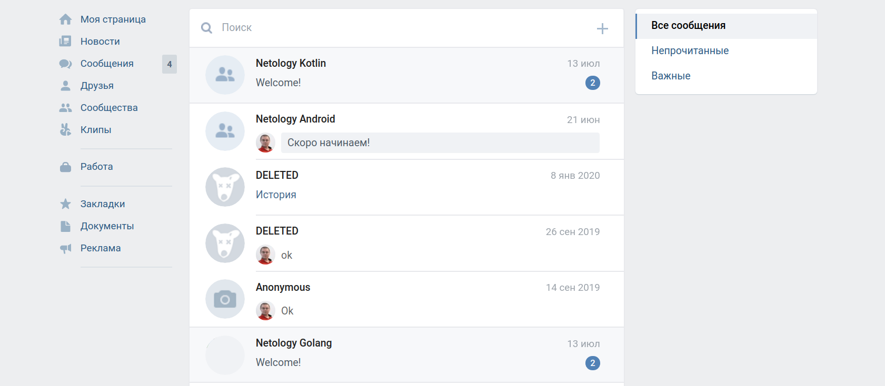

# Домашнее задание к занятию «3.3. Лямбды, extension-функции, операторы»

## Мини-проект. ChatService

Давайте посмотрим, как настраивать личные сообщения в социальном сервисе. 

Вы можете реализовать задачу так, как сочтёте нужным. Но вот несколько требований:
1. Должны быть чаты. Чат — это общение с одним человеком, так называемые `direct messages`.
1. Можно создавать чаты, удалять их, получать список имеющихся чатов.
1. В каждом чате есть сообщения от 1 до нескольких (см. раздел ниже).
1. Можно создавать сообщения, редактировать их и удалять. Для простоты — можно удалять и свои, и чужие.
1. В каждом чате есть прочитанные и непрочитанные сообщения.

Возможности для пользователя:
1. Видеть, сколько чатов не прочитано (например, `service.getUnreadChatsCount`). В каждом из таких чатов есть хотя бы одно непрочитанное сообщение.
1. Получить список чатов (например, `service.getChats`).
2. Получить список последних сообщений из чатов (можно в виде списка строк). Если сообщений в чате нет (все были удалены), то пишется «нет сообщений».
3. Получить список сообщений из чата, указав:
    * ID чата;
    * ID последнего сообщения, начиная с которого нужно подгрузить более новые;
    * количество сообщений.
После того как вызвана эта функция, все отданные сообщения автоматически считаются прочитанными.
1. Создать новое сообщение.
1. Удалить сообщение.
1. Создать чат. Чат создаётся, когда пользователю отправляется первое сообщение.
1. Удалить чат, т. е. целиком удалить всю переписку.

**Важный момент**: чтобы отделять одного пользователя от другого, передавайте во все функции первым параметром `id` пользователя. Например, `service.getChats(999)` — все чаты для пользователя с `id=999`.

Старайтесь использовать lambda-функции (их напишите сами) и extension-функции (есть в составе `Iterable`, `Collection`, `List`).

Расчёт статистики старайтесь производить как цепочку вызовов lambda-функций. Попробуйте обойтись без `for`, `while` и `do-while`.

Подсказки

1. Сообщения могут быть входящими и исходящими.
1. Непрочитанными могут быть входящие сообщения — тогда они участвуют в подсчёте статистики непрочитанных для получателя. Но могут быть и отправленные — тогда они не участвуют в подсчёте статистики для отправителя.

Итог: у вас должен быть репозиторий на GitHub, в котором расположен ваш Gradle-проект. Автотесты также должны храниться в репозитории.

**Важно**: автотесты должны быть, в том числе на исключения.

# Домашнее задание к занятию «3.4. Sequences»

## Мини-проект. ChatService Optimization

Оптимизируйте проект с предыдущего ДЗ (ChatService) и переведите его на `Sequence`.

Используйте изученные на лекции возможности, чтобы свести большую часть к цепочке вызова простых функций. Их мы обозначали терминами `filter-map-reduce`.

Оформите всё в виде Pull Request. Убедитесь, что после оптимизаций тесты проходят.

Итог: у вас должен быть репозиторий на GitHub, в котором есть Pull Request с изменениями.

**Важно**: автотесты в Pull Request должны быть, в том числе на исключения.

[**Ссылка на решение: Pull Request kt-homework-10-01**](https://github.com/bulashova/kt-homework-09-01/pull/1)